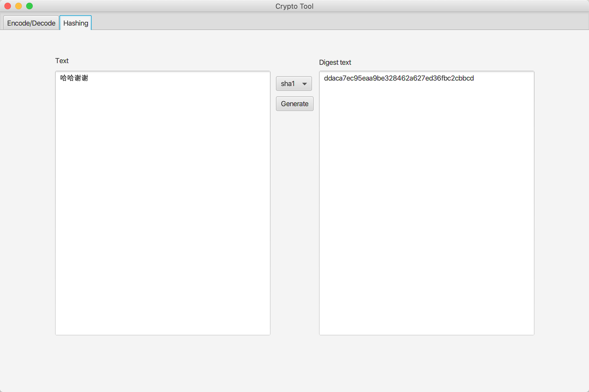

# crypto-tool

Reinvent the wheel.

Write crypto algorithm by myself.



## How to use

```bash
git clone https://github.com/zhengyhn/crypto-tool
cd crypto-tool
mvn clean jfx:native

```
This will install the application.

## GUI

This is a simple javaFx GUI application

## Implemented Algorithms

- Base64
- SHA1